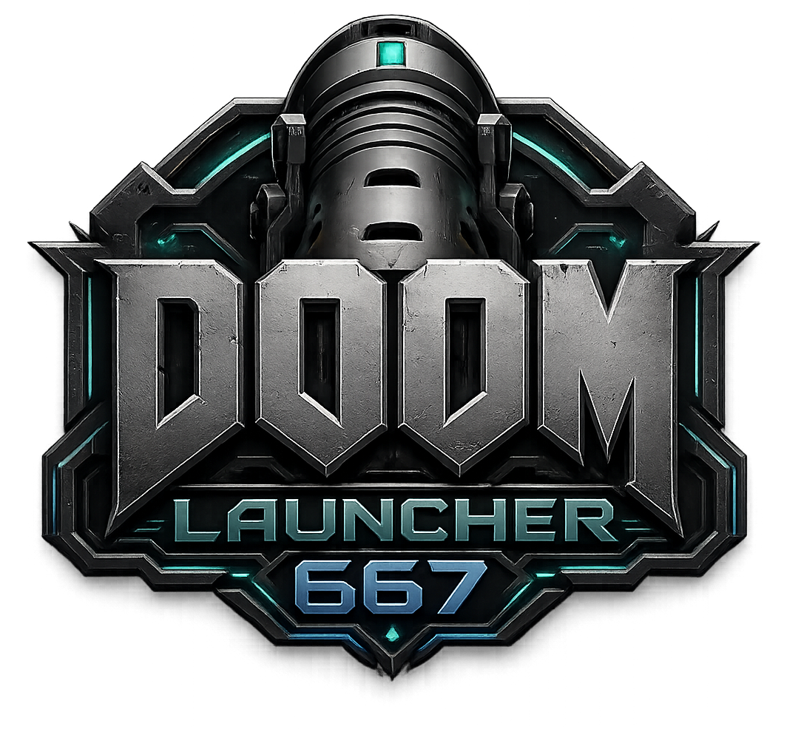
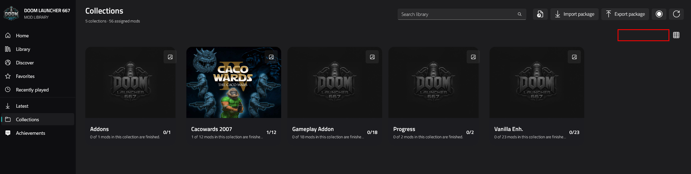
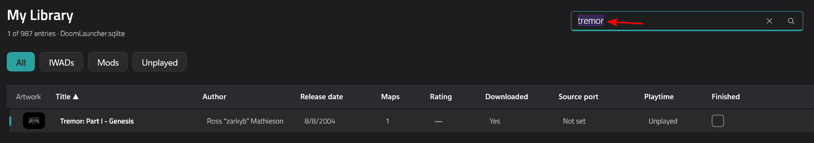
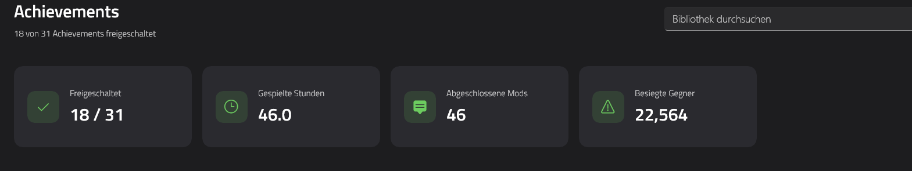
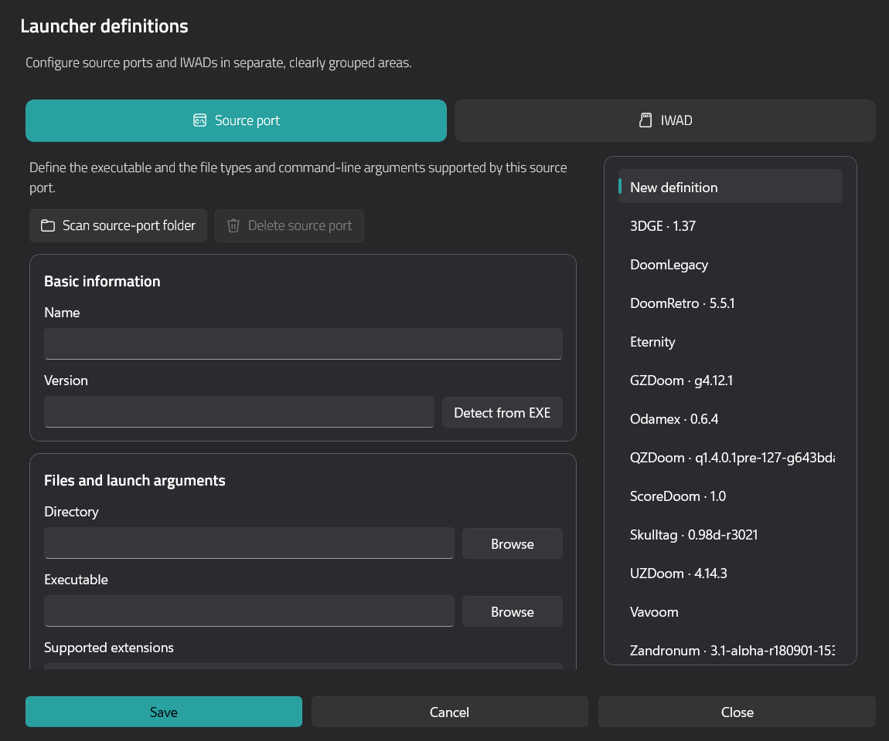

= Doom Launcher 667

Doom Launcher 667 is a modern, open-source and portable library launcher for
Doom-engine games and mods on Windows. It combines a responsive WinUI 3
interface with native game launching, IWAD and source-port setup, `/idgames`
integration, collections, achievements, screenshots and portable package
transfer.

The application available here is the new Doom Launcher 667, introduced with
version 0.8.0. It is a complete modern redevelopment and runs independently of
the classic Doom Launcher executable. The original
https://github.com/nstlaurent/DoomLauncher[Doom Launcher by hobomaster22]
remains its inspiration and the source of the migration compatibility work.

== Download

Download the latest Windows x64 beta ZIP from the
https://github.com/Realm667/DoomLauncher667/releases/latest[GitHub Releases
page]. Extract the complete archive into a writable folder and launch
`DoomLauncher667.exe`.

The download is self-contained; a separate .NET installation is not required.
On first start, a guided setup can scan portable IWAD, source-port and mod
folders or migrate an existing classic Doom Launcher installation.

To update, close Doom Launcher 667 and extract the newer package over the
existing installation. Release packages do not contain a personal database.
Your database, mods, screenshots, artwork, settings and custom themes are
preserved, and compatible schema migrations run automatically.

NOTE: Commercial IWADs and other copyrighted game data are not distributed
with Doom Launcher 667. Supply your legally obtained files during setup.

== Screenshots

=== Collections

=== Library

=== Achievements and statistics

=== Portable setup

== Features

=== Reimplemented from the classic Doom Launcher

These familiar workflows were rebuilt natively for Doom Launcher 667:

* portable SQLite library management and migration from a classic Doom
  Launcher installation;
* IWAD and source-port definitions with per-mod selection and launch options;
* `/idgames` discovery, download and metadata enrichment;
* favorites, recently played mods, playtime and user-defined collections;
* automatic metadata and map detection from supported mod archives;
* TITLEPIC extraction, artwork management and screenshot import;
* configurable map and skill selection for explicit advanced launches;
* preservation of compatible library metadata during migration.

=== New in Doom Launcher 667

* a responsive WinUI 3 experience with Home, Library, Collections, Discover,
  Latest and Achievements views;
* grid and table layouts, sortable/selectable columns, adjustable tile sizes
  and normal, compact or ultra-compact row and accordion densities;
* a showcase-style Home view with featured, unplayed, recent, favorite and
  IWAD-specific recommendations;
* collection artwork, collection browsing and optional collection filters in
  the main library;
* completion state, richer statistics and achievement notifications;
* capability-aware source-port definitions for screenshot and statistics
  adapters, plus executable version detection;
* IWAD recognition by hash and portable folder reconciliation;
* XML-based user themes, automatic text-contrast protection and English,
  German, French and Spanish localization;
* configurable grayscale or color placeholder artwork loaded from the
  portable data folders;
* selective import and export of individual mods, groups or complete
  collections, including archives, artwork, screenshots and metadata;
* guided first setup, database-health tools and an opt-in diagnostic mode;
* additive database migrations and a tested overlay-update contract for
  backwards-compatible portable upgrades.

== Modern WinUI 3 client

Doom Launcher 667 is centered on a native Windows App SDK / WinUI 3 client.
The portable `DoomLauncher667.exe` entry point starts the self-contained client
without a console window; the classic launcher executable is not required.

The runtime keeps mutable data beside the application so an installation can
be moved or backed up as one folder:

* `Data/Mods` stores managed mod archives;
* `Data/GameWads` stores portable IWAD archives and files;
* `Data/Sourceports` stores portable source-port installations;
* `Data/Screenshots`, `Data/TitlePics` and `Data/CollectionArtworks` store
  visual library data;
* `Data/Themes` contains the editable XML theme definitions;
* `Data/UserState` contains portable UI preferences;
* `DoomLauncher.sqlite` contains the library database.

Release builds validate that the visible client version, executable file
versions and package version all match before an archive can be published.

== Project status and feedback

Doom Launcher 667 is currently in public beta. Please report reproducible
problems and feature requests through
https://github.com/Realm667/DoomLauncher667/issues[GitHub Issues]. Include the
launcher version, source port and relevant diagnostic details where possible.

Technical architecture and migration notes are available in
link:docs/winui-rebuild.md[the WinUI 3 implementation guide].

== Origins and licensing

Doom Launcher 667 is inspired by the original Doom Launcher created by
hobomaster22. Compatibility and migration work retain the appropriate
attribution, while the application delivered from version 0.8.0 onward is the
new WinUI 3-based Doom Launcher 667 implementation.

See link:LICENSE[LICENSE] and
link:THIRD-PARTY-NOTICES.md[THIRD-PARTY-NOTICES.md] for licensing and
third-party attribution.
